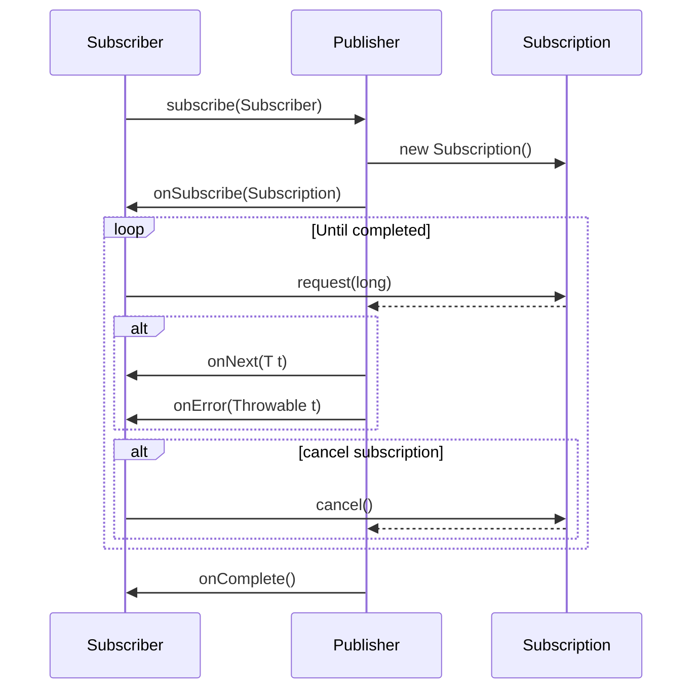

# Reactive stream
Reactive Streams is an initiative to provide a standard for asynchronous stream processing with non-blocking back pressure.

- minimum set of interfaces, methods and protocols

specifications [here](https://github.com/reactive-streams/reactive-streams-jvm/blob/v1.0.4/README.md)

